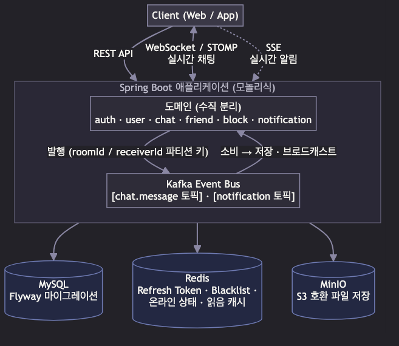
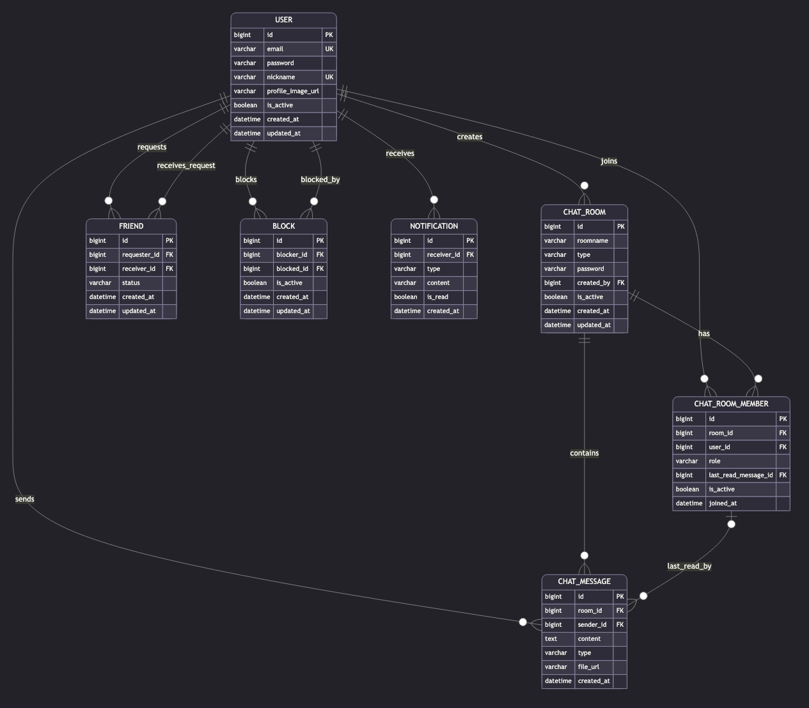
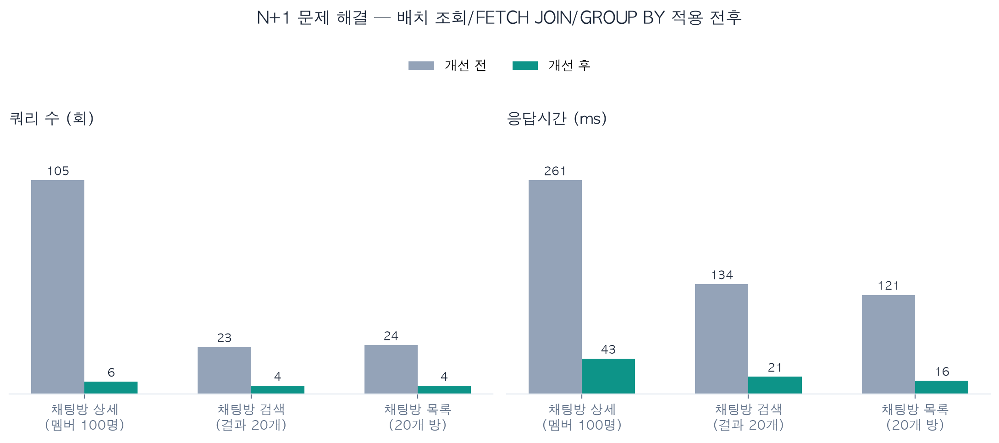
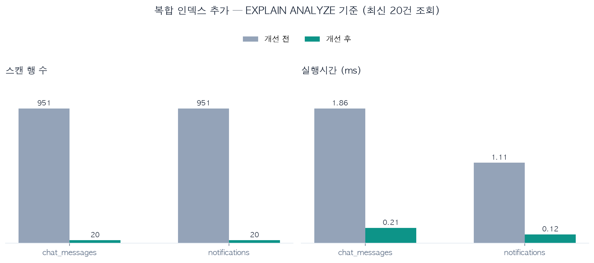

# 놀톡 (NolTalk)

Kafka 기반 실시간 채팅 플랫폼 — 모놀리식 아키텍처지만 채팅 메시지·알림 파이프라인은 Kafka 이벤트로 비동기 분리한 백엔드 프로젝트입니다.


[](https://github.com/GyeonghwanCheon/noltok/actions/workflows/ci.yml)

**개발 기간**: 2026-06-16 ~ 2026-07-15 (약 1개월) · **개인 프로젝트**

---

## 목차

- [기술 스택](#기술-스택)
- [핵심 기능](#핵심-기능)
- [아키텍처](#아키텍처)
- [ERD](#erd)
- [기술적 의사결정](#기술적-의사결정)
- [성능 개선](#성능-개선)
- [테스트](#테스트)
- [트러블슈팅 하이라이트](#트러블슈팅-하이라이트)
- [API 명세서](#api-명세서)
- [실행 방법](#실행-방법)

---

## 기술 스택

| 영역 | 기술 |
|---|---|
| Framework | Spring Boot 4.1.0, Java 17 |
| 인증 | JWT (Access 30분 + Refresh 7일, Redis 저장) |
| 실시간 (채팅) | WebSocket + STOMP |
| 실시간 (알림) | SSE (Server-Sent Events) |
| 메시지 브로커 | Kafka |
| 파일 스토리지 | MinIO (S3 호환) |
| 캐시/세션 | Redis |
| RDB | MySQL 8.x |
| DB 마이그레이션 | Flyway |
| 컨테이너 | Docker Compose |
| CI | GitHub Actions |

---

## 핵심 기능

- **인증**: 회원가입/로그인/로그아웃, JWT Access+Refresh Token 발급 및 Rotation
- **친구/차단**: 친구 요청·수락·거절, 유저 차단 및 차단 시 친구 관계 자동 해제
- **채팅방**: DIRECT(1:1)/GROUP(초대제)/OPEN(자유입장)/OPEN_PRIVATE(비밀번호) 4가지 타입, 생성/검색/입장/멤버초대/추방/관리자변경/나가기/삭제
- **실시간 채팅**: WebSocket+STOMP로 송수신, Kafka를 통해 저장·브로드캐스트를 비동기 분리해 메시지 유실 방지
- **파일 전송**: 이미지/파일 업로드 (MinIO, S3 호환 구조라 교체 용이)
- **실시간 알림**: SSE 기반, 친구 요청/채팅방 초대/채팅 메시지(오프라인 유저 대상) 알림을 Kafka로 발행

---

## 아키텍처



- **모놀리식 + Kafka 이벤트 기반**: 단일 서버 안에서 도메인은 수직 분리(`user/`, `chat/`, `friend/` 등)하고, 채팅 메시지·알림만 Kafka로 비동기 처리
- WebSocket 연결이 끊겨도 Kafka가 메시지를 보장, 저장/알림/캐시 무효화를 응답 경로에서 분리해 응답속도 확보

---

## ERD



7개 테이블(`users`, `chat_rooms`, `chat_room_members`, `chat_messages`, `friends`, `blocks`, `notifications`) — Refresh Token은 Redis(`@RedisHash`)로 이전되어 관계형 테이블에서 제외했습니다.

---

## 기술적 의사결정

몇 가지만 추렸습니다. 전체 40건 이상의 결정 기록은 개인 개발 문서로 별도 관리하고 있습니다.

- **모놀리식 + Kafka**: MSA로 바로 가기엔 과도한 초기 복잡도라 판단, 대신 채팅/알림처럼 유실 방지가 중요한 경로만 Kafka로 비동기 분리. 나중에 MSA 전환 시에도 Kafka 토픽 기준으로 자연스럽게 서비스 경계를 나눌 수 있는 구조
- **Refresh Token Rotation + Redis**: 재발급마다 토큰을 새로 교체(탈취 감지 목적), 초기엔 MySQL에 저장했다가 Repository를 인터페이스로 추상화해둔 덕분에 구현체 교체만으로 Redis 이전 완료
- **WebSocket 인증은 STOMP CONNECT 프레임에서 검증**: JWT를 쿼리 파라미터로 넘기면 서버 로그·브라우저 히스토리에 노출되는 문제를 피하기 위해 HTTP Handshake 대신 STOMP 프레임 레벨에서 검증
- **Soft Delete와 Hard Delete를 도메인마다 다르게 적용**: Friend는 이미 status enum이 있어 Hard Delete(상태 이중화 방지), Block은 이력이 중요한 Trust & Safety 기능이라 Soft Delete — 같은 "삭제"도 데이터 성격에 따라 반대로 결정
- **Kafka 파티션 키 전략**: `chat.message`는 roomId, `notification`은 receiverId를 키로 사용해 같은 방/같은 유저의 이벤트 순서를 보장하면서 다른 방·다른 유저는 병렬 처리

---

## 성능 개선

### N+1 쿼리 해결



| API | 쿼리 수 | 응답시간 |
|---|---|---|
| 채팅방 상세 조회 | 105 → 6회 (94.3%↓) | 261 → 43ms (83.5%↓) |
| 채팅방 검색 | 23 → 4회 (82.6%↓) | 134 → 21ms (84.3%↓) |
| 내 채팅방 목록 조회 | 24 → 4회 (83.3%↓) | 121 → 16ms (86.8%↓) |

### 인덱스 설계



무한 증가 테이블(`chat_messages`, `notifications`)에 복합 인덱스 추가 후 `EXPLAIN ANALYZE`로 검증 — 스캔 행 수 95%↓, 실행시간 약 9배 개선

### Kafka 채팅 메시지 파이프라인 부하 테스트

WebSocket → STOMP → Kafka → DB 저장 → 브로드캐스트 전체 경로에 동시 접속 부하를 걸어 측정했습니다.

| 항목 | 결과 |
|---|---|
| 동시 접속 | 30/30 성공 |
| 메시지 유실률 | 0.00% (전송·수신·DB 저장 건수 전부 일치) |
| 왕복 지연시간 평균 | 32.79ms (p95 49.41ms) |
| Kafka Consumer Lag | 0 유지 (steady-state 전 구간) |

---

## 테스트

단위 테스트(JUnit5+Mockito) + 통합 테스트(Testcontainers: MySQL/Kafka/Redis) + Controller 테스트(`@WebMvcTest`) 총 **133개**, 매 커밋마다 CI(GitHub Actions)에서 자동 실행됩니다.

- 검증 대상 성격에 따라 도구를 구분: 실제 쿼리 횟수·인덱스 사용 여부처럼 Mock으로는 검증 불가능한 것은 Testcontainers, 상태 전이·권한 검증처럼 Repository 반환값 통제만으로 충분한 것은 Mockito
- N+1 회귀 테스트를 Hibernate Statistics로 실제 쿼리 횟수까지 검증

---

## 트러블슈팅 하이라이트

**Refresh Token 재발급 시 JWT 토큰 충돌 (보안 버그)**
JWT의 `iat`/`exp`가 초 단위 정밀도라, 같은 초 안에 재발급을 두 번 호출하면 완전히 동일한 토큰이 발급되는 버그를 통합 테스트로 발견. `jti`(토큰 고유 식별자) 클레임 추가로 해결.

**인증 실패 시 403이 나가던 버그**
Spring Security의 `formLogin`/`httpBasic`을 둘 다 비활성화하면 기본 `AuthenticationEntryPoint`가 없어 인증 실패 시 401 대신 403이 나가는 걸 Controller 테스트에서 발견, 명시적 EntryPoint 등록으로 해결.

**부하 테스트 도구(k6) 자체의 동시 연결 결함**
k6로 WebSocket 부하 테스트를 시도했으나, VU가 2개 이상이면 `onopen` 콜백이 아예 호출되지 않는 결함을 발견(VU 여러 개든 프로세스 여러 개든 동일하게 재현). 서버 로직은 정상임을 먼저 확인한 뒤, Python `asyncio`+`websockets`로 직접 구현해 우회 — 코드가 더 단순하고 디버깅도 쉬웠음.

---

## API 명세서

[Notion에서 전체 API 명세서 보기](https://app.notion.com/p/NoLTok-c9656e5e4206824a881101d09f7cb6b9?source=copy_link)

---

## 실행 방법

```bash
# 1. 인프라 기동 (Kafka, Redis, MinIO)
docker compose up -d

# 2. .env 파일에 DB_URL/DB_USERNAME/DB_PASSWORD/JWT_SECRET 등 설정
#    (MySQL은 로컬에 별도로 설치되어 있어야 합니다)

# 3. 서버 실행
./gradlew bootRun
```

MySQL까지 컨테이너로 재현하려면 `docker-compose.prod.yml`을 사용하세요 (전체 인프라가 named volume으로 영속화됩니다).

```bash
docker compose -f docker-compose.prod.yml up -d
./gradlew bootRun
```
